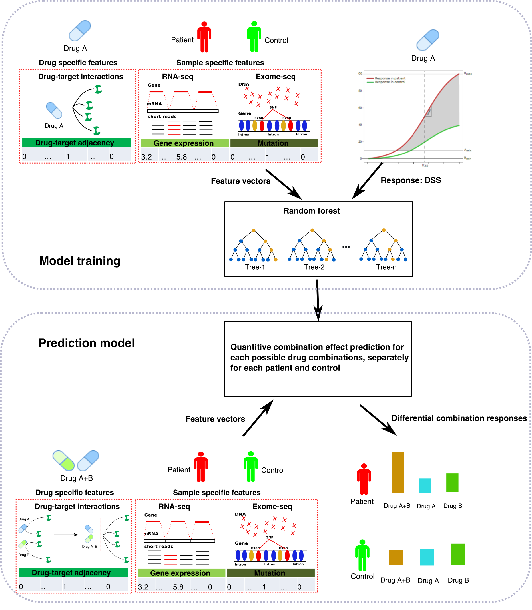

# ComboPred: prioritizing synergistic, selective, and clinially ationable mutli-targeting drug combinations for individual patients.

## Introduction
ComboPred is part of drug combination prediction and test (DCPT) platform. ComboPred combines the ex vivo sensitivity profiles of the patient’s response to the single compounds, with exome-seq and RNA-seq profiles of the same patient, through a systems-wide compound-target interaction network from our crowdsourcing bioactivity data platform, DrugTargetCommons (DTC) (https://drugtargetcommons.fimm.fi/).  

## Usage

## Support 
If you have any problems in using ComboPred, please contace **Liye He** (liye.he@helsinki.fi)

## Copyright & License

